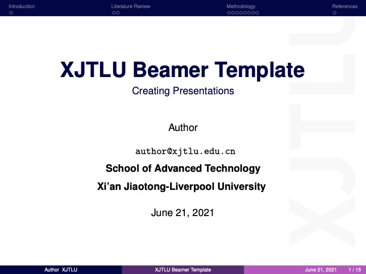

<div align="center">
    
</div>

<br/>

<!-- Title -->
<div align="center">
    <h1><b>XJTLU Beamer Template</b></h1>
</div>

<!-- Badges -->
[](https://www.latex-project.org/)

[](https://github.com/yaoshanliang/XJTLU-Beamer-Template/issues)
[](https://github.com/yaoshanliang/XJTLU-Beamer-Template/stargazers)
[](https://github.com/yaoshanliang/XJTLU-Beamer-Template/network)
[](https://github.com/yaoshanliang/XJTLU-Beamer-Template)
[](https://shields.io/)


<!-- Table of Contents -->
<p align="center">
    <a href="#what is it?">What is it?</a> •
    <a href="#for whom?">For Whom?</a> •
    <a href="#usage">Usage</a> •
    <a href="#tips">Tips</a>
</p>

<!-- Sections -->
## What is it?
Thanks to [Template Beamer UFC](https://github.com/maumneto/TemplateBeamerUFC). This template is modified based on that project.

This project aims to create a template for presentation for the Xi’an Jiaotong-Liverpool University (XJTLU). It was created a class called **xjtlu_format.cls** with a set of environments and commands related to the document. This template is not an official document from the XJTLU. However, this template can be used to create classes, presentations, short courses, etc.

## For Whom?

This template can be useful for the XJTLU professors and students.

- <b>Professors:</b> for creating classes and presentations
  
- <b>Students:</b> for assignments and presentations

- <b>Others:</b> for works and presentations

## Usage

Copy or download the project.

- <b>Overleaf:</b> https://www.overleaf.com/latex/templates/xjtlu-beamer-template/sfrvnnpcsmgh
  
- <b>Github:</b> https://github.com/yaoshanliang/XJTLU-Beamer-Template

## Tips

Some tips for using this template

### Blocks

- Default Block
  
```tex
    \begin{block}{Default Block}
        Body of default block.
    \end{block}
```

- Alert Block
  
```tex
    \begin{alertblock}{Alert Block}
        Body of alert block.
    \end{alertblock}
```

- Example Block
  
```tex
    \begin{exampleblock}{Example Block}
        Body of example block.
    \end{exampleblock}
```

### Texts

- Example text
```tex
 \example{Text Example}
```

- Emphasis text
```tex
 \emph{Text emphasis}
```

### Boxes

- Simple Box

```tex
\simplebox{testando o simple box}
```

- Alert Box

```tex
\alertbox{testando o alert box}
```

- Success Box

```tex
\successbox{testando o success box}
```

### Codes

It is possible to insert codes in this presentation. This template uses two packages for algorithms: `algorithm2e` and `listings`. 

- **Documentation** 
  
  - algorithm2e: [Algorithm2e Package Documentation](http://linorg.usp.br/CTAN/macros/latex/contrib/algorithm2e/doc/algorithm2e.pdf)
  
  - listings: [Listings Package Documentation](http://linorg.usp.br/CTAN/macros/latex/contrib/listings/listings.pdf)

The following example shows how to create a pseudocode:

```tex
\begin{algorithm}[H]
    \SetAlgoLined #includes indentation
    \LinesNumbered #includes lines number
    \SetKwInOut{Input}{input}
    \SetKwInOut{Output}{output}
    \Input{write the input}
    \Output{write the output}
    \KwData{write the data}
    \KwResult{Write the result}
    initialization\;
    \While{While condition}
    {
        instructions\;
        \eIf{condition}{
           instructions1\;
           instructions2\;
           }{
           instructions3\;
        }
    } 
    \caption{How to write algorithms}
\end{algorithm}
```

The following example shows how to insert a code that is in the project files:

```tex
\begin{frame}{Including Codes}
    \lstset{language=Python}
    \lstinputlisting[language=Python]{path_of_python_code.py}
\end{frame}
```

The following example shows how to insert a figure:

```tex
\begin{figure}
    \centering
    \caption{Caption of the Figure}
    \includegraphics[scale=1]{path_of_the_figure}
    \source{Source of the Figure}
    \label{fig:figlabel}
\end{figure}
```

The following example shows how to insert a multi-columns:

```tex
\begin{columns}{}
    \begin{column}{0.5\textwidth}
        \justify
        Text of the left side!
    \end{column}
    \begin{column}{0.5\textwidth}
        \justify
        Text of the right side!
    \end{column}
\end{columns}    
```

### Custom Commands

This template has some custom commands that are described below:

To put the department name
```tex
\department{Department Name}
```

To put the email
```tex
\email{user@domain}
```


